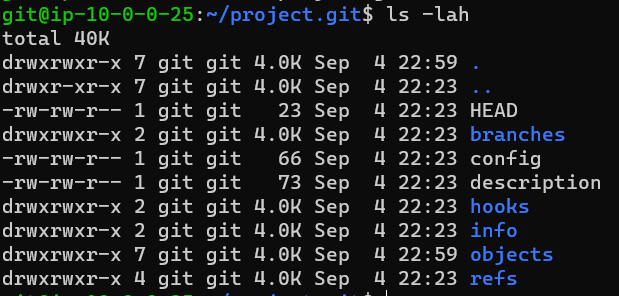
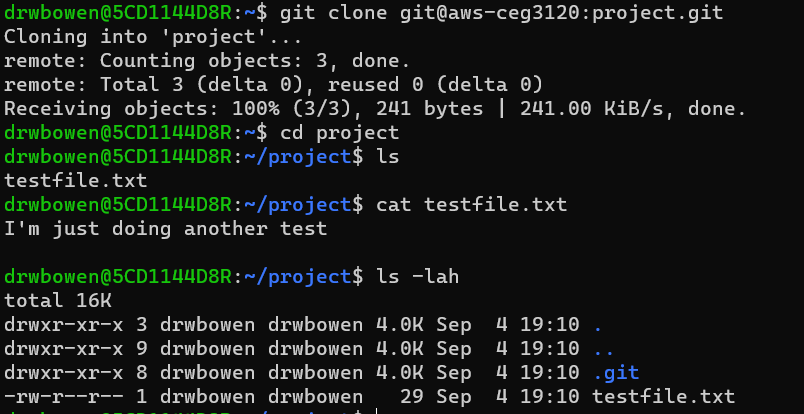
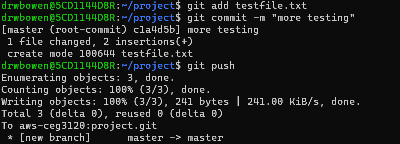

# My Project 1 

# ADD GIT
to add the user git to my AWS system I used "sudo adduser git" and then just used the defaults for their information. to be able to ssh into the AWS environment as git I changed using "sudo su git" and created them a .ssh folder and gave them an authorized_keys file. I then copied and pasted the public key from the ubuntu's authorized_keys file to git's authorized_keys file. I then went into my home system and created a config file in my home .ssh folder and added:
 Host aws-ceg3120
        HostName 44.198.62.124
        User ubuntu
        IdentityFile /home/drwbowen/ceg3120-aws-vm.pem
I was then able to ssh into the AWS system as the git user by using "ssh git@aws-ceg3120" and get into the AWS system as git.

# CREAT & CLONE REPO
to create the repo I first used the "ssh git@aws-ceg3120" to ssh into the git user for this AWS instance. I then used "git init --bare project.git" to create the git repo. I used the --bare because I was having trouble pushing things to repos that were created without bare. 
I then went to the terminal for my personal computer and used "git clone git@aws-ceg3120:project.git" to clone the repo onto my personal terminal.

Here is the created repo:

Here is the cloned repo

# ADDING TO REPO
after I was able to clone my repo i was able to create a file called testfile.txt and by using "git add testfile.txt", to stage the file to get ready to push. then "git commit -m "testing"" to commit the file with the coment that I am going to be adding this file to my repo. and then "git push" I was able to succefully push the file from my home system to the remote system

here is a screen shot of me adding, commiting and pushing a test file:

