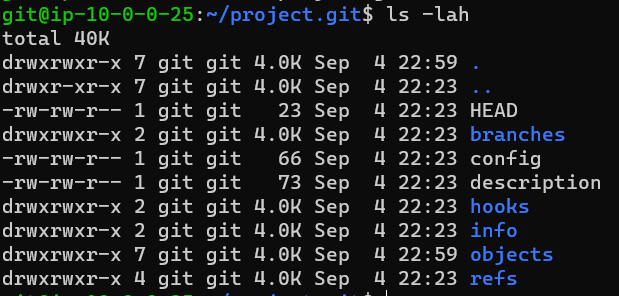
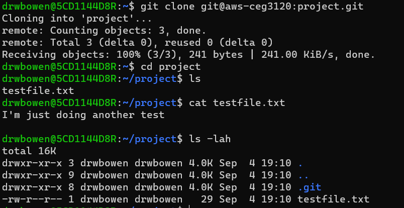
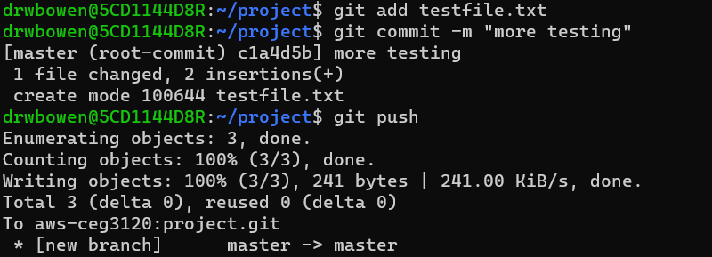

# My Project 1 

# ADD GIT
to add the user git to my AWS system I used "sudo adduser git" and then just used the defaults for their information. to be able to ssh into the AWS environment as git I changed using "sudo su git" and created them a .ssh folder and gave them an authorized_keys file. I then copied and pasted the public key from the ubuntu's authorized_keys file to git's authorized_keys file. I then went into my home system and created a config file in my home .ssh folder and added:
 Host aws-ceg3120
        HostName 44.198.62.124
        User ubuntu
        IdentityFile /home/drwbowen/ceg3120-aws-vm.pem
I was then able to ssh into the AWS system as the git user by using "ssh git@aws-ceg3120" and get into the AWS system as git.

# CREAT & CLONE REPO
to create the repo I first used the "ssh git@aws-ceg3120" to ssh into the git user for this AWS instance. I then used "git init --bare project.git" to create the git repo. I used the --bare because I was having trouble pushing things to repos that were created without bare. 
I then went to the terminal for my personal computer and used "git clone git@aws-ceg3120:project.git" to clone the repo onto my personal terminal.

Here is the created repo:

Here is the cloned repo

# ADDING TO REPO
after I was able to clone my repo i was able to create a file called testfile.txt and by using "git add testfile.txt", to stage the file to get ready to push. then "git commit -m "testing"" to commit the file with the coment that I am going to be adding this file to my repo. and then "git push" I was able to succefully push the file from my home system to the remote system

here is a screen shot of me adding, commiting and pushing a test file:

# USAGE GUIDE

git clone - this is used to clone an already existing repository to a new directoy and at another location, once this is done you are then able to modify, and add to the repo locally. with this I am able to create a repo on the remote terminal and clone it onto my local terminal. I order for this to work ensure that on the system that you are trying to clone the repo to has the proper public access keys for the system that you are trying to clone the repo from, and that you are the only one that has read privilege's to your private keys. when you clone a repo you get all of the files, branches and commits that have happened to the repo. an example of how to use this command is like I did for this project. I used the "git clone git@aws-ceg3120:project.git". the git clone part says that I want to clone a repo, you then need to specify where the repo is, so that is where the git @aws-ceg3120:project.git. the aws-ceg3120 is the same command that I use to ssh into the remote server, and the project.git is the name of the repo that I am wanting to clone.

git init - this command is used to create a new empty git repo. this is the command you will use first when you are starting a new project. An example is how I created the repo for this project by using "git init --bare project.git". when you use the --bare comand it creates a bare repo, which means unlike a normal repo where you get the .git folder, when you use --bare all of the contents of the .git folder are added to the working directory that you created when you used git init. I used --bare becasue There is some communication issues when I created a repo that that wasn't --bare and I was unable to add to the remote repo.

git add - this comand adds the specified file contents that you are wanting to add to your git repo, to the index. to use this command just type git add fileName, and it will add the file to the index.

git commit - this comand will record the changes that were made to the repo that you have made, this command is also used after you use the git add command to add the specified files to the index. you will have to also make a comment as to what it is that you are adding to the repo. What I have found to be my favirot way to use git commit, is to use git commit -m "your comment here". With this the comment in the quotes is the comment for the commit.

git push - this is used to push the changes that were made to the index from the local repo that you have cloned, to the remote repo. To use this command jut simply type git push in the command line and press enter. This is the last command that is used after git add, and git commit. 

