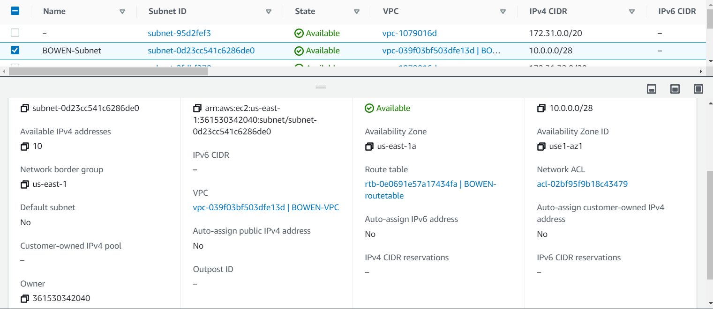
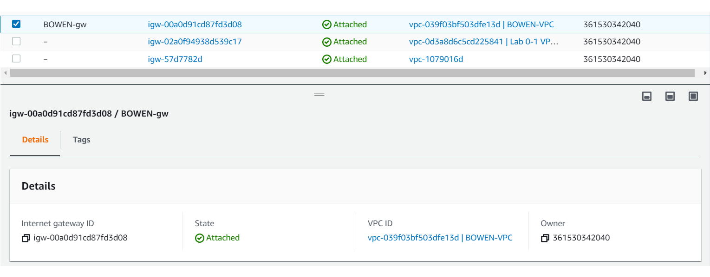
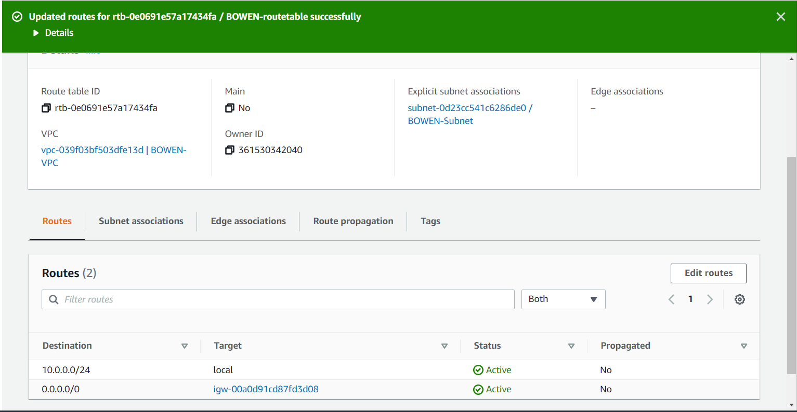
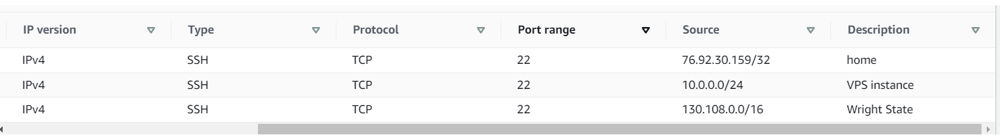
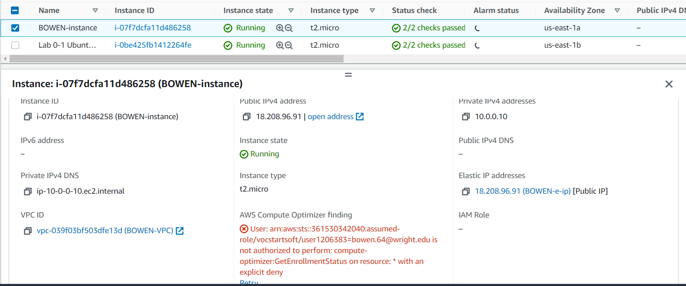
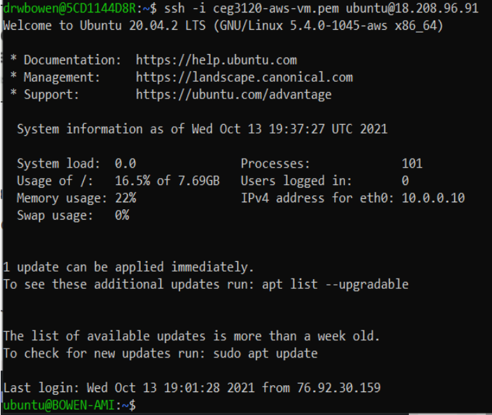

# MY PROJECT 3

## PART 1
- 1-VPC
    - A VPC is a virtual private cloud, this allows us to create a cloud based service to run in our AWS instances.
- screenshot of my VPC creation: 

- 2- Subnet
    - THe subnet is what gives the range of IP address that are allowed to be used on this VPC

- 3-

- 4-

- 5-

## PART 2
- I used the unbuntu server 20.04 AMI, the default user is ubuntu. the instance type that I selected is t2.micro. 
- to attatch my VPC after I selected the instance type, I went to the network dropdown menu and selected "BOWEN-vpc"
- I left my Auto-assign Public IP as disabled, which is the default. I did not want AWS to change my IP address whenever they felt the need to, and then I end up being confused as to why I could not SSH into my instance that I created. 
- to attach volume to my instance I jsut left the size at 8, and the volume type as general purpose SSD (gp2), if you wanted to change these things you just simply enter whatever value you would like in the respective fields on the add storage menu. 
- I then added a tag in the add tag menue by clicking on the add tag button, and set the key to Name, and the value to BOWEN-instance.
- I then attached my security group by selecting the "select an existing security group" button and selected BOWEN-sg.
- to reserve an elastic IP address, I selected the elastic-IP tab from the menu on the left hand side of the screen, then clicked the Allocate elastic IP address. Left everything as the default and added the tag BOWEN-e-ip. then selected allocate. 
- screen shot of my instance:

- to change my host name I used sudo hostnamectl BOWEN-AMI to change the host name for this instance. 
- screenshot of my SSH connection:
- 